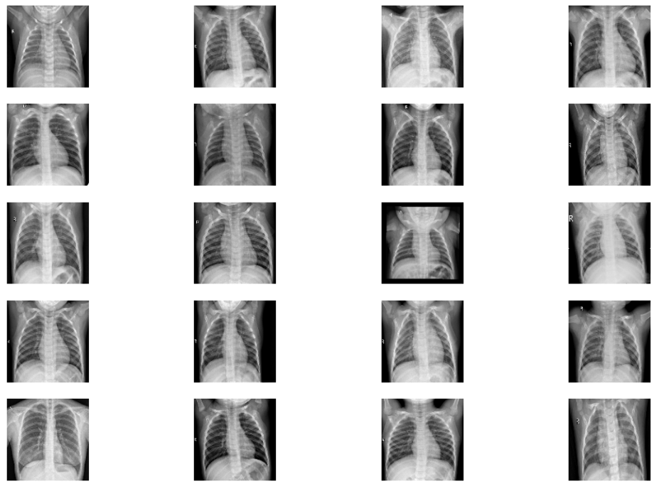
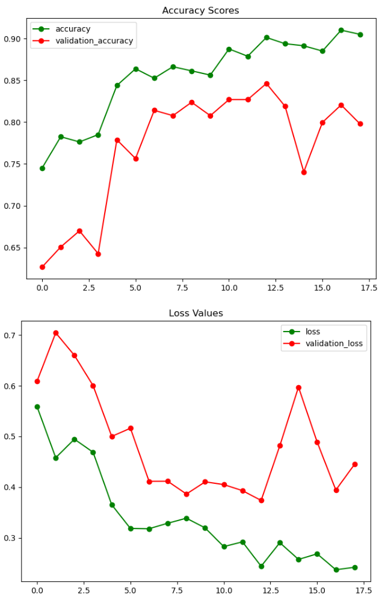

## Convolutional Neural Network - Pneumonia X-ray Detection

CNN machine learning model trained on X-ray scans to detect symptoms of pneumonia.

### Features

- Sequential Model using 4 convolutional layers utilizing ReLU activation function and final fully connected layer for flattening
- Compiled utilizing Adam optimization algorithm and CC loss function
- 20 epochs with 50 steps per epoch

### Results

Accuracy: 90.5%

### Sources

Dataset: https://www.kaggle.com/paultimothymooney/chest-xray-pneumonia

Referenced: https://www.kaggle.com/pranjalverma08/pneumonia-detection-from-scratch
